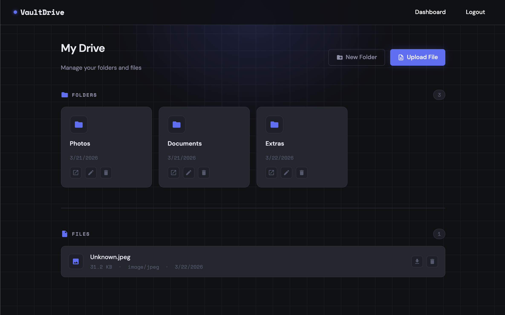

# VaultDrive

A full stack personal cloud file storage application built with Node.js, Express, and Supabase. Users can register, log in, upload files, organize them into folders, and manage everything from a clean dashboard. The website is live [here](https://vaultdrive.up.railway.app/).



## Features

- **Authentication** — Secure session-based auth with Passport.js and bcrypt password hashing
- **File Uploads** — Upload files via drag & drop or file browser with type and size validation (Multer + Supabase Storage)
- **Folder Management** — Create, rename, and delete folders with cascading file deletion
- **File Management** — View file details, download, move between folders, and delete
- **Dashboard** — Central hub showing all folders and root-level files at a glance
- **Protected Routes** — All file and folder operations require authentication

## Tech Stack

| Layer          | Technology                   |
| -------------- | ---------------------------- |
| Runtime        | Node.js                      |
| Framework      | Express                      |
| Authentication | Passport.js (Local Strategy) |
| ORM            | Prisma                       |
| Database       | PostgreSQL (Supabase)        |
| File Storage   | Supabase Storage             |
| File Uploads   | Multer                       |
| Templating     | EJS                          |
| Deployment     | Railway                      |

## Database Schema

```prisma
odel User {
  id Int @id @default(autoincrement())
  firstName String
  lastName String
  username String @unique
  password String
  createdAt DateTime @default(now())
  updatedAt DateTime @updatedAt
  files File[]
  folders Folder[]
}

model File {
  id Int @id @default(autoincrement())
  fileName String
  storedName String
  fileSize Int
  mimeType String
  path String
  createdAt DateTime @default(now())
  updatedAt DateTime @updatedAt
  userId Int
  user User @relation(fields: [userId], references: [id], onDelete: Cascade)
  folderId Int? // optional, since we can have a file with no folder (root directory)
  folder Folder? @relation(fields: [folderId], references: [id], onDelete: Cascade)
}

model Folder {
  id Int @id @default(autoincrement())
  name String
  createdAt DateTime @default(now())
  updatedAt DateTime @updatedAt
  userId Int
  user User @relation(fields: [userId], references: [id], onDelete: Cascade)
  files File[]
}

```

## Getting Started

### Prerequisites

- Node.js v18+
- A [Supabase](https://supabase.com) account with a project and storage bucket named `uploads`

### Installation

1. **Clone the repository**

```bash
git clone https://github.com/yourusername/vaultdrive.git
cd vaultdrive
```

2. **Install dependencies**

```bash
npm install
```

3. **Set up environment variables**

Create a `.env` file in the root of the project:

```env
DIRECT_URL="your-supabase-postgresql-connection-string"
SUPABASE_URL="your-supabase-project-url"
SUPABASE_KEY="your-supabase-secret-key"
PORT=3000
```

4. **Generate the Prisma client and run migrations**

```bash
npx prisma migrate dev --name init
npx prisma generate
```

5. **Start the development server**

```bash
npm run dev
```

The app will be running at `http://localhost:3000`.

## Deployment

This project is configured for deployment on [Railway](https://railway.app).

The `postinstall` script in `package.json` automatically runs `prisma generate` after dependencies are installed, ensuring the Prisma client is available in the Railway environment.

```json
"scripts": {
  "start": "node app.js",
  "postinstall": "prisma generate"
}
```

Add all variables from your `.env` file to Railway's environment variables dashboard before deploying.

## Environment Variables

| Variable       | Description                               |
| -------------- | ----------------------------------------- |
| `DIRECT_URL`   | Supabase PostgreSQL connection string     |
| `SUPABASE_URL` | Supabase project URL                      |
| `SUPABASE_KEY` | Supabase secret key (service role)        |
| `PORT`         | Port to run the server on (default: 3000) |

## License

MIT
